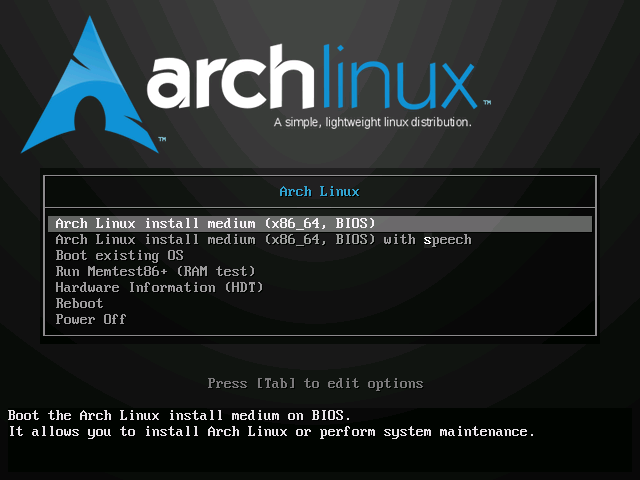
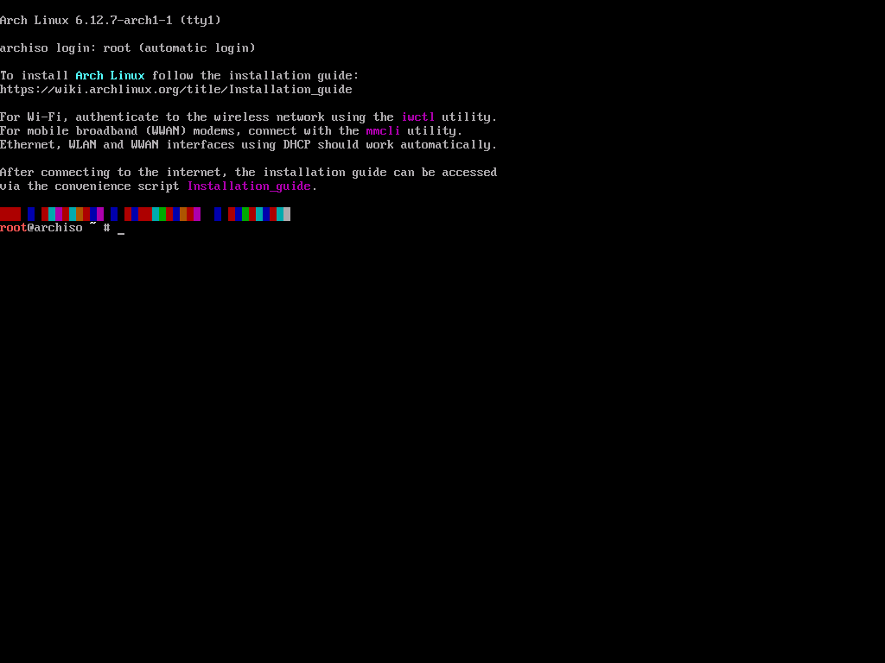
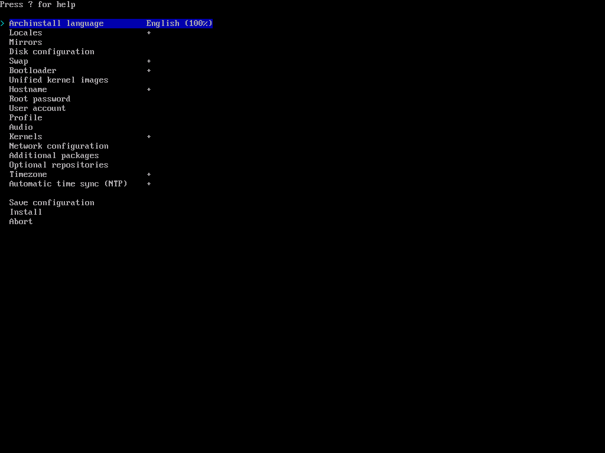

# Windows? Linux

## 为什么你应该用 Linux

1. 贴近生产环境与开发者工具链
   - 服务器环境主导: 绝大多数服务器, 云计算平台(如 AWS, Azure), 容器技术(如 Docker/Kubernetes)均基于 Linux. 熟悉 Linux 的操作和运维是开发者必备技能.
   - 原生开发工具链: Linux 对编程语言(Python, C/C++, Java, Go 等), 编译器(GCC/Clang), 调试工具(GDB), 构建工具(Make/CMake)以及脚本环境(Bash)的支持更原生, 无需依赖第三方模拟器或兼容层.
   - 包管理高效: 通过 `apt`(Debian/Ubuntu), `dnf`(Fedora)或 `pacman`(Arch)等包管理器, 可快速安装开发库, 工具和依赖项, 避免手动下载安装的繁琐.
2. 命令行与自动化能力
   - 强大的 Shell 生态: Linux 的命令行工具(如 `grep`, `sed`, `awk`, `ssh`, `tmux`)和脚本能力(Bash/Python)是开发者的核心生产力工具, 适合处理文本, 自动化任务, 远程服务器管理.
   - 开发流程无缝衔接: 从本地代码编写, 编译, 测试到部署到服务器, Linux 提供一致的环境, 避免跨平台兼容性问题(如 Windows 换行符, 路径分隔符导致的错误).
3. 开源与可定制性
   - 系统透明可控: Linux 允许开发者深入操作系统内核, 网络协议栈, 文件系统等底层机制, 适合学习计算机原理(如操作系统, 编译原理课程).
   - 高度可定制: 开发者可以自由配置开发环境(如窗口管理器, 终端工具链), 优化性能, 甚至修改内核参数, 满足特定需求.
4. 社区与学习资源
   - 开发者导向的社区: Linux 生态的文档(如 `man` 手册, Arch Wiki), 论坛(Stack Overflow, GitHub)和开源项目资源更贴近开发者需求, 问题解决效率高.
   - 前沿技术支持: 多数开源项目(如 Kubernetes, TensorFlow, Node.js)优先适配 Linux, 新工具和框架在 Linux 上的支持更完善.
5. 轻量化与资源效率
   - 低资源占用: Linux 对硬件资源(CPU, 内存)的需求更低, 适合在虚拟机, 老旧设备或笔记本上流畅运行, 提升开发效率.
   - 稳定性与安全性: Linux 系统崩溃概率低, 病毒攻击风险小, 适合长期运行的开发任务.

## Linux 小知识

按理来说, 我应该好好写写 Linux 的背景知识, 发展历程, GNU 和自由软件, 开源软件什么的. 但我懒得写了, 我打算教你一些黑话, 让你可以到处装逼. 😎

### Linux, GNU/Linux, Systemd/Linux

如果有人向你提起 Linux, 你可以这么跟他说: 应该是 GNU/Linux 才对. 不过按现在各大 Distro 的情况来看, 说 Systemd/Linux 也不为过.

解释:

- Linux: 一个操作系统内核, 并不等于操作系统本身
- GNU/Linux: 当初 GNU 一直缺一个可用的内核, 于是把 Linux 拉了过来. GNU 的各个组件都能运行在 Linux 上, 而 Linux 作为承载 GNU 组件的内核. 这样的组合被成为 GNU/Linux, 并沿用至今
- Systemd/Linux: Systemd 是一套服务管理工具, 在现代 Linux Distro 中, 它大包大揽了非常多的事务. Linux 如果少了 GNU 组件, 一样能找到一些好用的替代品, 但要是少了 Systemd, 可能连启动都没法启动. 考虑到 GNU/Linux 名称的来历, 我们可以按同样的方法叫 Systemd/Linux.

> Systemd 真的能引导启动, 我在用的就是 Systemd-boot 引导启动.

### Tragedy of Systemd

> [视频链接](https://www.youtube.com/watch?v=o_AIw9bGogo)

简单来说, Systemd 是 Linux 中的一个初始化系统(init system)和服务管理器, 它提供了一系列用于初始化系统, 管理系统进程, 服务, 日志, 设备, 网络和其它系统资源的工具套件.

> 回忆一下操作系统的知识: init system 是操作系统启动时运行的第一个进程(PID=1)

这么看来 Systemd 似乎很厉害, 一个软件能干这么多事情. 但这也违背了 Unix 哲学: 一个工具只做一件事. Unix 原教旨主义者普遍讨厌 Systemd All-in-One 的设计. 但我觉得吧, 在系统编程的层面, 死扣着独立设计/模块化设计的哲学也没必要, 有时候需要一些更灵活的手段. 包括 Linux 内核自己都不是所谓的微内核.

事实上, Systemd 的效率和规范化远胜于它的前任 SysVinit, 也比常见的 cron 配置文件好写得多, 反正我觉得用起来挺顺手的.

但对于系统开发者来说, Systemd 的设计是有问题的. 它在 kernel 和 user 之间插入了一层 system, 但它也没有明确地定义 system 的边界, 即 system 应该做什么, 不应该做什么. 这就使得, 如果你对 Systemd 的某个功能模块不满意, 想自己写一个更好的, 那么你要么自己实现一个完整的 Systemd 来代替掉它创建的 system 层, 要么你就只能用 Systemd, 并在它的源码上进行有限的修改. 而且大而全的 Systemd 没有保留 kernel 和 user 的直通接口, 这可能会影响到用户对系统开发的可定制性.

> 而且 Systemd 的开发者曾经开发过 pulseaudio, 是一个 bug 一堆的音频控制工具, 不如 pipewire 一根. 所以 Systemd 的代码质量是不如 Linux 内核的.

但是管他呢, 我又不是系统程序员, 用 Systemd 就用吧.

### Tragedy of GNU

与其说是 Tragedy of GNU, 不如说是 Tragedy of Free Software.

自由软件的兴起, 发展, 衰落我懒得写了, 网上讲自由软件运动的视频有很多. 曾经轰轰烈烈的自由软件运动已经被各大商业公司用*开源软件*偷梁换柱了. 现在的热词是*开源*软件, 但实际上, 开源软件和自由软件是两个概念. 具体参考[开源错失了自由软件的重点](https://www.gnu.org/philosophy/open-source-misses-the-point.html).

如果你也想成为一名**自由软件**支持者, 一个最简单的步骤就是, 在你发布你的软件和源代码时, 采用最新的 GPL 系列 License. 比如 GPL-v3 和 AGPL-v3.

### Tragedy of Linux

Linux 社区采用的开发和管理方式是仁慈君主独裁制, 即所有的 code review 都由 Linus 本人最终负责. 然而可惜的是, Linus 本人并不是一个自由软件者, 尽管 Linux 前被冠上了 GNU 的名号. 当时 GNU 和 Linux 的合作, 只是迫于 UNIX 的巨大压力下而达成的. Linus 本人并不是多么在意自由软件的理念, 比起理念, 他更像是一个实用主义者. 尽管 GNU 推出了最新版的 GPL-v3 协议和 AGPL-v3 协议, 进一步确保了软件和代码的**自由**, 并且自由软件创始人理查德·斯托曼(Richard Stallman)也曾多次建议 Linus 将 Linux 的协议从 GPL-v2 升级到 GPL-v3, 但都被 Linus 无视了.

在 2024 年 10 月 18 日, Linux 社区发生了一件足以被钉在历史耻辱柱上的事: Linus 未经社区审议和正常流程, 直接将若干个来自俄罗斯的内核模块维护者移除维护名单. 并且面对社区的质疑, Linus 本人发邮件回复, 表达了自己对俄罗斯国籍的敌意.

可悲可叹, 开源社区的精神支柱 Linus, 亲手打碎了大家树立起来的神像. 这一刻, Linus 以前爆过的所有的典, 都化成了巨大的回旋镖打在了自己脑门上.

> Linus: code is cheap, show me your nationality.

## Linux 发行版及其刻板印象

Linux 发行版(Distro)是基于 Linux 内核开发出的完整操作系统. 基于不同的设计思想和理念, 以及不同的应用场景, Linux 社区衍生出了众多的发行版. 这里我首先列举出**自由**的 [GNU/Linux 发行版](https://www.gnu.org/distros/distros.html). 一个令人悲伤的事实是, 考虑到各大商业公司的驱动, 固件等都不是自由的, 为了能满足日常流畅使用, 主流的 Linux 发行版不得不包含这些非自由的固件, 因而丧失了自己自由的性质.


> 刻板印象就图一乐, 认真你就输了. 😂

### Debian 系列

- Debian: 正统发行版, 曾经一度是坚定的 GNU/Linux, 可惜还是在现实的重压下低头了. 因为其标志特别像雌二醇包装盒上的标志, 因而被认为是男娘系统. 如果你在用 Debian, 那记得加我 QQ, 我喜欢香香软软的小男娘. 🥰


- Ubuntu: 声量最大的 Linux 发行版, 曾经一度让小白以为 Ubuntu == Linux, 可能也是很多小白的第一款 Linux. 由商业公司 Canonical 开发并维护, 塞满了公司的私货(比如 snap 包管理器)以及一些神奇的政治倾向. Ubuntu 系统饱受诟病的一点就在于它十分不稳定, 动不动就给你弹一个报错. 如果你在用 Ubuntu, 那就别用了, 换个发行版吧.
- Deepin: 国产的操作系统. 很抽象, *国产*, *开源*, 这两个词竟然能凑在一起. 我只简单地尝试过, 鉴定为比 Ubuntu 还不如的东西. 如果你在用 Deepin, 那我相信你也一定在用鸿蒙.
- NixOS: 一种很新的东西, 自己重新搞了一套独立的包管理系统, 采用函数式的声明来配置整个系统. 我只是简单地用过, 懒得学习 Nix 语言, 就没用了.

### Red Hat 系列

- Red Hat Enterprise Linux(RHEL): 红帽企业版 Linux, 红帽公司推出的商业 Linux 发行版, 专注于企业商用.
- Fedora: 红帽公司推出的社区版 Linux, 专注于个人开发者. Red Hat 会将 Fedora 作为新特性的试验田, 当特性成熟稳定后会进入到 RHEL 中. 所以 Fedora 算是 RHEL 的上游.
- CentOS: 已经死掉了的 Linux 发行版, 本来是作为社区版的 RHEL 在运行的, 结果被 Red Hat 收购之后就成了 RHEL 的上游去了, 换言之, 企业商用所追求的稳定性和安全性就没有了. 如果你在用 CentOS, 那你应该是买了国内老掉牙的 Linux 入门书籍. 国内企业也是用 CentOS 居多. 很符合我对国内的刻板印象.
- OpenEULER: 华为推出的 RHEL 衍生版, 仅在做数据库实验时用过, 臭不可闻. 如果你在用 OpenEULER... 🫡😅

### Arch 系列

- Arch Linux: 我的日常操作系统, 只有你用了才知道它的好. 如果你也在用 Arch Linux, 那太棒了, 你一定是和我一样的小男娘, 快来加个 QQ 吧! 😘


- Manjaro: 你是? 都用这个了, 为什么不直接一步到位用 Arch Linux 呢?
- SteamOS: 惊不惊喜, 意不意外? SteamOS 其实是 Arch Linux 的衍生版. 如果你玩 Steam Deck, 那你已经在不知不觉间用上了 Linux 了!

### Gentoo 系列

- Gentoo: 我没用过, 我不知道.

## 安装 Linux

前面我已经简单介绍了几个知名的 Linux 发行版, 相信你也选择出了你想要安装的 Linux 发行版. 我正在使用的是 Arch Linux, 我强烈推荐 Arch Linux, 后文的所有内容我也会基于 Arch Linux 撰写.

想要安装 Arch Linux, 有若干方法可供选择:

- 👍 做好文件备份, 然后把你的 Windows 丢到垃圾桶里去, 直接在物理机上安装 Arch Linux. (推荐)
- 👍 购买/组装一台新电脑, 然后安装 Arch Linux. (推荐)
- 考虑到你正在使用 Windows, 可以在 WSL2 中安装 WSL2-Arch. (推荐)
- 在 Windows 上安装虚拟机, 然后安装 Arch Linux.
- 使用双系统, 在已有 Windows 的基础上安装 Arch Linux.

### WSL2-Arch

参考[这篇文章](https://orion-zhen.github.io/article/how-to-code-on-windows)

### 完整地安装 Arch Linux

#### 准备工作

首先从[ISO镜像源](https://mirrors.tuna.tsinghua.edu.cn/archlinux/iso/latest/)找到最新的 ISO 镜像文件, 下载到本地.

> Arch Linux 采用滚动更新的策略, 所以不会像 Ubuntu 一样有特定的版本号. Arch Linux 会每隔一段时间创建一个最新的系统快照, 作为 ISO 镜像文件使用.

然后准备一个将这个镜像烧入到你准备好的启动U盘中. Windows 下可选 [Rufus](https://rufus.ie/zh), Linux 下可选 [balenaEtcher](https://etcher.balena.io).

烧录完成后, 将电脑从启动U盘启动, 即可进入 Arch Linux 安装界面.



> 注意, 如果是笔记本的话, 记得先在 BIOS 中关闭安全启动, 不然会无法安装.

选择第一项 **Arch Linux install medium**, 按回车键即可进入安装.

在一阵炫酷的文字滚动后, 你会进入如下界面:



现在我们已经成功进入了 Arch Linux 的安装界面. 这里我们将使用 `archinstall` 来快速且方便地安装 Arch Linux.

#### 配置网络

如果你已经通过有线网络连接到互联网, 那就不用额外配置网络连接. 如果你的笔记本没有无线网口, 那么就要使用 `iwctl` 命令来连接无线网络.

首先输入 `iwctl`, 然后按回车键, 进入 `iwctl` 命令行界面.

然后输入 `device list`, 列出所有的无线网卡. 这里假设你的无线网卡是 `<card-name>`.

然后用以下命令搜索可用的无线网络:

```shell
device <card-name> scan
```

搜索完成后, 找到你想要连接的网络, 假设为 `<wifi-name>`.

输入以下命令连接无线网络:

```shell
device <card-name> connect <wifi-name>
```

之后会提示你输入 WiFi 密码, 输入密码后即可连接到网络.

使用 `exit` 命令退出 `iwctl` 命令行界面.

现在你已经成功连接到网络了.

#### 换源

Arch Linux 默认采用的是国外的源, 会很慢. 所以推荐使用 `reflector` 进行换源:

```shell
reflector -c China --sort rate --latest 20 --verbose --save /etc/pacman.d/mirrorlist
```

命令解释:

- `reflector`: 是一个用来更新 pacman 源的工具.
- `-c`: 国家参数, 这里选择 China 内的镜像源
- `--sort`: 排序手段, 这里按照镜像源的下载速率从高到低排序
- `--latest`: 显示前 20 个镜像源
- `--verbose`: 显示详细信息
- `--save`: 将更新后的源列表保存到 `/etc/pacman.d/mirrorlist` 文件中

当命令完成后, 即可使用 `pacman -Syu` 命令更新系统软件.

#### 安装系统

输入:

```shell
archinstall
```

然后按回车键, 进入安装程序:



由于版本不同, 你看到的界面可能和我有所不同, 但需要配置的项目都是一样的. 让我们来逐一配置:

- Archinstall language: 不要动
- Locales: 不要动, 等装完了再改
- Mirrors: 不要动, 已经用 `reflector` 配置过了
- Disk configuration: 配置磁盘
  - Partitioning: 磁盘分区
    - Use a best-effort default partition layout: 使用默认分区方案, 建议选这个
      - 选择你要安装的硬盘, 然后进入 Filesystem 选择:
        - btrfs: 推荐, 支持很多高效的特性
          - use BTRFS subvolumes with a default structure: 使用 BTRFS 子卷, 并使用默认结构, 建议选择 Yes
          - use compression or disable CoW: 使用压缩或禁用 CoW, 建议选择 Use compression
          - separate partition for /home: 分离 /home 目录, 建议选择 No
        - ext4: 老牌选择, 兼容性好
        - xfs/f2fs: 没用过, 不知道
    - Manual partitioning: 手动分区
- Disk encryption: 不要动
- Swap: 不要动
- Bootloader:
  - systemd-boot: 推荐, 支持 UEFI.
  - grub: 兼容性和可配置性强. 随你.
- Hostname: 主机名, 取一个你喜欢的名字
- Root password: Root 用户密码
- User account: 配置普通用户
  - Add a user: 添加一个普通用户
    - Username: 用户名, 只能用小写字符
    - Password: 密码, 可以设置成和 Root password 一样
    - should \<username\> be a superuser (sudo)?: 是否授予 sudo 权限, 建议选择 Yes
  - Confirm and exit: 确认并退出用户配置
- Profile: 安装方案
  - Type: 安装类型
    - Desktop: 安装桌面环境, 有 GUI, 你可以选择若干桌面环境. 以下是我的选择(使用空格键勾选, 使用回车确认并退出)
      - [x] KDE Plasma
      - [x] Hyprland
      - Seat access: 权限认证工具, 我选择 `polkit`, 因为这是 KDE 内置的工具
    - Minimal: 最小化安装, 除了系统本体, 啥都没有
    - Server: 服务器安装, 会安装用于网络服务器的组件, 没有 GUI
    - Xorg: 不知道, 我没用过
    - Graphics driver: 当你选择 Desktop 选项后出现, 如果你是 N 卡用户, 则选择 Nvidia(proprietary); 否则不要动
    - Greeter: 登录界面, 不要动
- Audio: 选 pipewire
- Kernels: 不要动
- Network configuration: 安装完成后新系统配置网络的方式, 如果你选择安装的 Desktop 中有 KDE Plasma 或者 GNOME, 则可以选择 Use NetworkManager
- Additional packages: 安装一些额外的软件包, 不要动, 可以等安装完了在新系统里自己装
- Optional repositories: 额外的软件仓库, 建议勾选 multilib, 因为里面有 Steam (笑)
- Timezone: 时区, 键入 `/shanghai` 即可跳转到 `Asia/Shanghai` 时区, 回车选择确认
- Automatic time sync: 自动校时, 不要动

当一切配置完成, 你可以选择下方的 Install 选项, 回车确认后, 此时系统会自动开始安装.

#### 本地化

当 `archinstall` 安装完成后, 会提示是否 `chroot` 进入新系统. 选择 Yes 进入新系统终端, 输入命令:

```shell
vim /etc/locale.gen
```

找到并取消注释如下内容所在的行:

```text
zh_CN.UTF-8
```

保存退出后用如下命令更新本地化设置:

```shell
locale-gen
```

### Arch Install: Odyssey

虽然使用 `archinstall` 工具安装 Arch Linux 非常方便快捷, 但我还是建议你至少按照 [arch wiki](https://wiki.archlinuxcn.org/wiki/%E5%AE%89%E8%A3%85%E6%8C%87%E5%8D%97) 完整地手动走一遍安装流程, 这对你理解 Linux 系统的运行原理和结构有很大帮助.

## 配置 Arch Linux

在 KDE Plasma 桌面环境中, 快捷键 Crtl+Alt+T 可以快捷打开终端.

GUI 的美化千千万, 你可以自己探索你喜欢的美化设置. 这里我将主要讲解终端的美化和配置.

### 更换系统字体和语言

你不能直接将系统语言更换为中文, 因为此时系统缺少中文字体. 使用如下命令安装常用字体:

```shell
sudo pacman -S ttf-hack-nerd noto-fonts-cjk
```

然后在系统设置中, 先更改字体为 `Noto Sans CJK SC`, 再更改语言为简体中文.

### 添加第三方源

Arch Linux 有许多有用的第三方源, 可以让你不用翻墙就能安装一些好用的软件. 使用 vim 打开 `/etc/pacman.conf`, 在末尾加入以下内容:

```text
[archlinuxcn]
SigLevel = Optional TrustAll
Server = https://mirrors.cernet.edu.cn/archlinuxcn/$arch

[arch4edu]
SigLevel = Optional TrustAll
Server = https://mirrors.cernet.edu.cn/arch4edu/$arch
```

保存退出后, 使用 `sudo pacman -Syu` 更新软件源.

### 安装 AUR 助手 yay

yay<sup>archlinux-cn</sup> 是 Arch Linux 的 AUR 助手, 它可以帮助你管理 AUR 软件包, 并自动编译安装. 从 archlinuxcn 仓库安装 yay:

```shell
sudo pacman -S yay
```

需要导入密钥时, 选择同意导入.

### 安装常用软件

可以参考[安装脚本](https://github.com/Orion-zhen/dotfiles/blob/main/install.sh)中的内容, 自助选择需要安装的软件.

### 输入法设置

使用 Fcitx5 作为输入法:

```shell
sudo pacman -S fcitx5-im fcitx5-chinese-addons
```

然后在 系统设置 > 虚拟键盘中 选择 Fcitx5 作为输入法.

### 终端美化

我的美化方案需要用到以下软件:

```shell
sudo pacman -S ttf-hack-nerd zsh tmux fzf fd bat eza tldr thefuck trash-cli atuin autojump starship
```

请先将你的终端字体切换到 Hack Nerd Font, 否则无法显示某些符号.

#### 切换默认终端

将默认终端切换为 zsh:

```shell
sudo chsh -s /bin/zsh
```

#### 安装 oh-my-zsh

```shell
sh -c "$(curl -fsSL https://raw.githubusercontent.com/ohmyzsh/ohmyzsh/master/tools/install.sh)"
```

#### 安装主题和扩展

```shell
git clone --depth=1 https://github.com/romkatv/powerlevel10k.git ${ZSH_CUSTOM:-$HOME/.oh-my-zsh/custom}/themes/powerlevel10k
git clone https://github.com/zsh-users/zsh-autosuggestions ${ZSH_CUSTOM:-$HOME/.oh-my-zsh/custom}/plugins/zsh-autosuggestions
git clone https://github.com/zsh-users/zsh-syntax-highlighting.git ${ZSH_CUSTOM:-$HOME/.oh-my-zsh/custom}/plugins/zsh-syntax-highlighting
git clone https://github.com/wfxr/forgit.git ${ZSH_CUSTOM:-~/.oh-my-zsh/custom}/plugins/forgit
mkdir ${ZSH_CUSTOM:-$HOME/.oh-my-zsh/custom}/plugins/incr
curl -fsSL https://raw.githubusercontent.com/Orion-zhen/incr-zsh/main/incr.zsh -o ${ZSH_CUSTOM:-$HOME/.oh-my-zsh/custom}/plugins/incr/incr.zsh
```

#### 配置 .zshrc

`.zshrc` 文件位于你的用户目录下, 是控制终端行为的配置文件.

```shell
curl -fsSL https://raw.githubusercontent.com/Orion-zhen/dotfiles/main/.zshrc -o ~/.zshrc
```

现在重启电脑, 你应该可以看到一个漂亮的终端了.

------

© 2025. ICS Team. All rights reserved.
