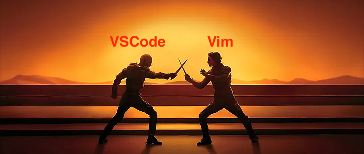
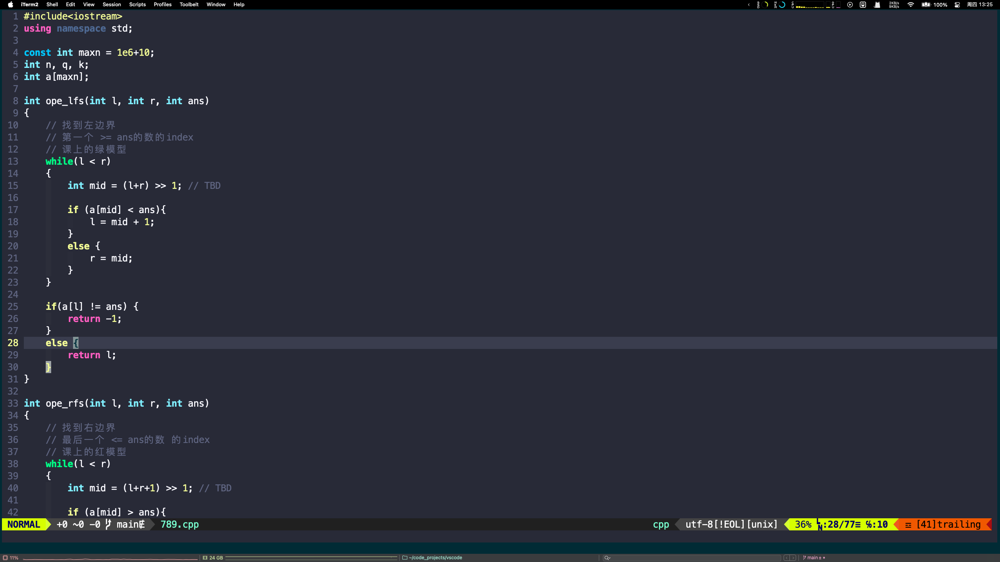
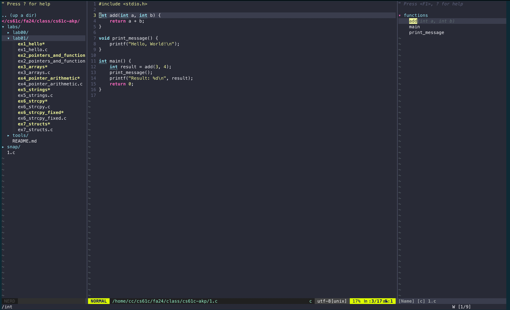

# VSCode? Vim!

## 编辑器圣战

重生于5202年，你踏足这颗蔚蓝的星球🚀

在这片浩渺的宇宙中，依然流传着两大神器的传说：Vim，传闻它是神之编辑器；而VSCode，被誉为编辑器之神。

追求独步天下的英豪，或是尚显稚嫩的新人，纷纷朝圣前往，想一探Vim的真容。可当他们看到那简朴而素净的界面时，心中难免生出疑问：这真的是神器吗？甚至有些人，心头泛起了轻视之情。

有的人大声讥讽：“什么年代了，居然还抱着这陈旧的工具不放？”

有的则无端评论：“Vim不过是时代的尘埃，新时代必然要革新而废弃！”

更有甚者，举起了写满“打倒Vim”的大字报。鲁镇街头，烟花绽放，锣鼓喧天，声势浩大...

就在这时，一位白须长者从众人中走出，他缓缓开口，声音低沉却有力：“所有人都冷静片刻，听我一言！它们虽然古老，已历百年风霜，但你们可曾思考过，为什么这古老的编辑器，依然有如此众多的人为之归依？”

鲁镇的百姓开始了沉思。

经过长久的思索，有人勇敢地尝试了Vim，甚至Emacs，却因那陡峭的学习曲线，几乎难以承受。面对界面的生疏，退出命令的繁琐，许多人选择放弃，感叹：“这也太难用了，连界面都不知如何退出，何谈其他！”

然而，依旧有一部分人没有放弃，他们坚信着这一切的背后必定有着不为人知的力量...

这场编辑器的圣战，或许还远未结束...



## 一份适合纯新手入门的Vim教程

```admonish
我们默认这份指南的面向群体是：连`:wq`保存退出都不知道的纯新手用户
```

在这份教程里，我们一反网上各类博客/教程的顺序，即：Vim工作原理优先，按需增量加配置在后。

我承认这是本源上的学习步骤，并没有问题，这才是对的✅

但是它不适合新手入门！⚠️⚠️⚠️

对于第一次接触Vim的群体而言，我认为他们最需要的是在短时间内，尽可能多的感受到Vim作为“文本编辑器”的使用方式，而不是设计原理/配置方式等太过底层的东西。

因此，这份教程的顺序是：

1. 给出一份“标准”的vim配置模板，开箱即用，无需思考
2. 学生自行安装（安装方式等见后文）
3. 按教程尝试如何使用Vim写代码，快速入门
    - 快捷键
    - 不同模式切换
    - ...
4. 待学生熟悉Vim基本使用方式后，讲解部分原理和模板配置

## 配置文件

`~/.vimrc`文件内容，你可以直接在[我的仓库](https://github.com/root-hbx/Config-Vim-Neovim/blob/master/vimrc)复制：

## 如何配置

在你的命令行中，敲入:

```lua
vim ~/.vimrc
```

复制上述文件内容，`:wq`保存退出。

然后再进入vim，输入`:PluginInstall`，等待插件安装完成即可（如有提醒直接按`Enter`即可）。

此时你打开一份正常的`.cpp`代码，应该可以看见界面长这样:



现在就可以直接使用了🎉

## 常用指法

> 免责申明：下面的部分指法只适用于笔者的vimrc配置，也就是说，如果你严格遵循上述步骤，那就ok；但是你要是有自己额外的个性化配置，那就不保证了

```admonish
现在使用我的vimrc，你会发现有几个最方便的点：

1. 可以用鼠标/触控板进行光标移动
2. 复制/粘贴可以直接用鼠标, 且对复制全文进行了快捷键定义 (空格 + a)
3. 默认 tab 缩进是 4

其实已经失去了vim的灵魂了🤡

像语法高亮/状态栏/搜索高亮之类的就不用说了，肯定都是有的🚀
```

## 基础操作

### Normal Mode

__插入__

```lua
i -- enter insert mode and begin inserting or deleting text
a -- enter insert mode, one space after cursor position
<escape> -- enter normal mode
```

__保存退出__

```lua
<:q!> -- quit without writing
<:wq> -- write and quit
```

__移动__

```lua
<Up/Down/Left/Right> -- 方向键
```

```lua
number + <Up/Down/Left/Right> -- 向上/下/左/右移动几number格
```

__词单元__

```lua
<w> -- next word 
<b> -- beginning of word
<e> -- end of word
<0> (zero) -- move to beginning of line
<$> -- move to end of line
<^> -- first non-null part of the line
```

我已经将`<0>` and `<$>` 重定向成 `shift -` and `shift +`了, 很明显我的开箱即用教程已经最大程度地减轻需要记忆的负担 :)

```lua
<number w,b> -- eg: <4w> - moves forward 4 words
```

__跳转__

```lua
<G> -- go to end of file
<gg> -- go to beginning of file
```

```lua
<ctrl u> -- scroll up (half a page)
<ctrl d> -- scroll down (half a page)
```

__查找__

```lua
< /search_item > -- searches for all occurrences in the file
<n> -- jumps to the next occurrence
<N> -- jumps to the previous occurrence
```

__删除__

```lua
dd -- delete this line
cc -- delete this line and into `Insert` mode
```

__撤销和回退__

```lua
<u> -- undo edit
<ctrl r> -- redo edit
```

__复制和粘贴__

```lua
<yy> -- yanks(or copies) current line
<p> -- pastes copied item
y5<Right> -- 复制右边的5个字符

<space>a -- 复制全文进入系统粘贴板
```

__注释/解注释__

我是用 [NerdCommenter](https://github.com/preservim/nerdcommenter) 做的

并且将快捷键全部改成了 `<shift> /`

- 行注释/解注释: 来到对应行, 使用 `<shift> /`即可
- 段注释: `V`进入visual模式，选中所需区域，使用 `<shift> /`即可

__分屏__

> s + 方向键

```lua
s <Right> -- 向右分屏
s <Left> -- 向左分屏
s <Up> -- 向上分屏
s <Down> -- 向下分屏
```

__分屏时切换光标的区域__

> q + 方向键

```lua
q <Right> <C-w>l
q <Left>  <C-w>h
q <Up>    <C-w>k
q <Down>  <C-w>j
```

__在vim打开的file中执行终端命令__

```lua
:!<command> -- eg: :!ls 就会在终端中执行命令
```

### Visual Mode

```lua
<V> -- enter multi-lined visual line mode
<v> -- enter single-lined visual mode
```

Actions:

```lua
<y> -- copy current item
<d> -- delete current item -> automatically goes to clipboard, so you can <p> to paste it
<escape> -- go back to normal mode
```

## 彩蛋

__显示文件系统结构__

```lua
ff -- 按下ff就会自动显示文件系统结构，鼠标点击即可打开细节
```

__代码分层显示__

```lua
T -- 按下 shift + t 会显示代码中的Tag，分好层级
```

显示效果应该如下：



__一些别的指法__

重新开一个 iterm2 窗口 (左右分屏)

```lua
<cmd + d> -- 水平分屏
```

重新开一个 iterm2 窗口 (上下分屏)

```lua
<cmd + shift + d> -- 垂直分屏
```

下面是一些mac常用的指法：

```sh
<control> + <d> 退出（logout），常用于服务器/虚拟机退出
<control> + <l> 等价于清屏命令clear
<control> + <c> 暂停，programmer都知道
```

## 后续

事实上新时代Vim Family Tree里还有很多，比如 [neovim](https://neovim.io/)。

这里提供一份开箱即用的版本，[lazynvim](https://www.lazyvim.org/)，用过的都说好🚀

不过笔者自己还是更喜欢“自配的vim”，毕竟这个更有geek风😄

这份简明教程就结束了，如果你有一些比较好的建议 or Vim插件推荐，plz feel free to report an issue [here](https://github.com/xjtu-ics/textbook/issues) 👏

如果你想contribute more，尤其是想另写一篇 《vim? neovim!》之类的，欢迎[PR](https://github.com/xjtu-ics/textbook/pulls) 🎉

------

© 2025. ICS Team. All rights reserved.